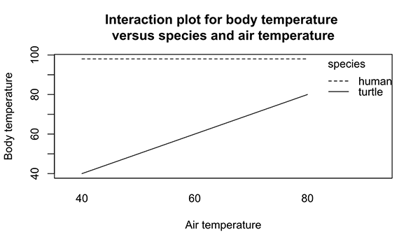
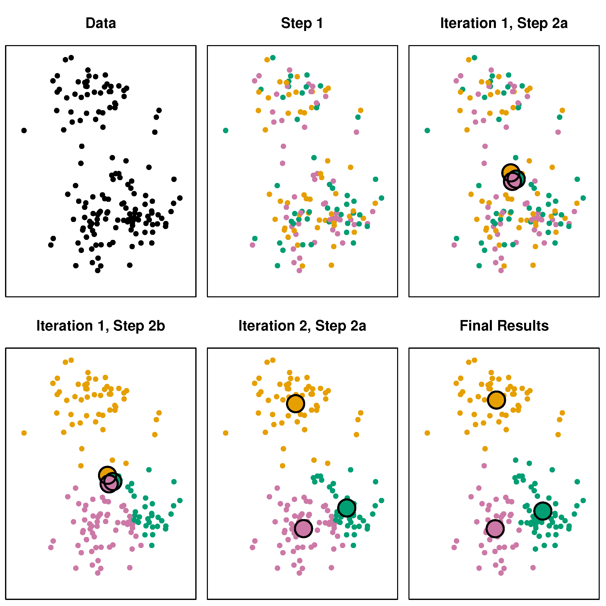

# Today 

## This lecture and practical

- Merging Data / Data Table

- Linear models

- Robust linear modeling

- Logistic models 

- Visualizing marginal effects

- Clustering

## Packages used
```{r message=FALSE}
library(dplyr)
library(magrittr)
library(mice)
library(bench)
library(ggplot2)  
library(class)    
library(mvtnorm)  
library(psych)
library(caret)
```

# Joining data in base `R`

## Merging data sets
Let's consider the following data example:
```{r}
df1 <- data.frame(id = c(1:6), 
                  city = c(rep("Utrecht", 3), rep("Rotterdam", 3)))
df2 <- data.frame(ID = c(2, 4, 6), 
                  year = c(1984, 1982, 1990))
head(df1)
head(df2)
```
## Inner join
```{r}
merge(x = df1, y = df2, by.x = "id", by.y = "ID")
```

This is a **natural join**, or **inner join**. Only the cases from `df1` that have a match in `df2` are returned. 

## Outer join
```{r}
merge(x = df1, y = df2, by.x = "id", by.y = "ID", all = TRUE)
```
All rows are returned

## Outer join TOWA
```{r}
merge(y = df1, x = df2, by.y = "id", by.x = "ID", all = TRUE)
```

## Left outer join
```{r}
merge(x = df1, y = df2, by.x = "id", by.y = "ID", all.x = TRUE)
```

## Left outer join TOWA
```{r}
merge(y = df1, x = df2, by.y = "id", by.x = "ID", all.x = TRUE)
```

## Right outer join
```{r}
merge(x = df1, y = df2, by.x = "id", by.y = "ID", all.y = TRUE)
```

# joining data with `dplyr`

## Data sets
```{r}
band_members
band_instruments
```

## inner join
```{r}
band_members %>% inner_join(band_instruments)
```

`dplyr::inner_join(x, y)` returns all rows from x where there are matching values in `y`, and all columns from `x` and `y`. 

- If there are multiple matches between `x` and `y`, all combination of the matches are returned.

## left join
```{r}
band_members %>% left_join(band_instruments)
```
`dplyr::left_join(x, y)` returns all rows from `x`, and all columns from `x` and `y`. 

- Rows in `x` with no match in `y` will have `NA` values in the new columns. 
- If there are multiple matches between `x` and `y`, all combinations of the matches are returned.

## right join
```{r}
band_members %>% right_join(band_instruments)
```
`dplyr::right_join(x, y)` returns all rows from `y`, and all columns from `x` and `y`. 

- Rows in `y` with no match in `x` will have `NA` values in the new columns. 
- If there are multiple matches between `x` and `y`, all combinations of the matches are returned.
 
## full join
```{r}
band_members %>% full_join(band_instruments)
```
`dplyr::full_join(x, y)` returns all rows and all columns from both x and y. Where there are not matching values, returns NA for the one missing.

## Filtering joins: semi
- `dplyr::semi_join(x, y)` 
```{r}
band_members %>% semi_join(band_instruments, by = "name")
```

- `dplyr::anti_join(x, y)` 
```{r}
band_members %>% anti_join(band_instruments, by = "name")
```

## nest join
```{r}
band_members %>% nest_join(band_instruments, by = "name")
```

## Tibbles
```{r}
a <- band_members %>% nest_join(band_instruments)
a$band_instruments
```

## Tibbles
Tibbles are a modern take on data frames with a couple of improvements. For example, tibbles are more memory efficient:
```{r}
set.seed(123)
l <- replicate(26, sample(1000), simplify = FALSE)
names(l) <- letters

timing <- bench::mark(
  as_tibble(l),
  as.data.frame(l),
  check = FALSE)

timing
```

## Naming with `tibble`
```{r}
a <- data.frame(abc = 1)
a$a
a <- tibble(abc = 1)
a$a
a$abc
```

# Linear models

# The linear model

## Notation
The mathematical formulation of the relationship between variables can be written as

\[
\mbox{observed}=\mbox{predicted}+\mbox{error}
\]

or (for the greek people) in notation as
\[y=\mu+\varepsilon\]

where

-  $\mu$ (mean) is the part of the outcome that is explained by model 
-  $\varepsilon$ (residual) is the part of outcome that is not explained by model 


## Univariate expectation
```{r, echo=FALSE}
library(ggplot2)
set.seed(123)
plotdata <- data.frame(X = rnorm(100, 167.5, 10),
           Y = rnorm(100, 180.8, 10)) 
plotdata %>%
  ggplot(aes(X, Y)) + 
  geom_point(color = "blue") + 
  geom_point(aes(mean(X), mean(Y)), color = "orange", size = 5) + 
  geom_vline(xintercept = 168.4041, color = "orange") + 
  geom_hline(yintercept = 179.7245 , color = "orange") + 
  ggtitle(bquote("Bivariate normal")) + 
  theme_minimal()
```

## Conditional expectation
```{r echo=FALSE}
fit <- plotdata %$%
  lm(Y~X)

plotdata %>%
  mutate(predicted = predict(fit),
          residuals = residuals(fit)) %>%
  ggplot(aes(X, Y)) +
  geom_smooth(method = "lm", se = FALSE, color = "orange") +
  geom_segment(aes(xend = X, yend = predicted), color = "orange", alpha = .5) +
  geom_point(aes(color = abs(residuals))) + 
  scale_color_continuous(low = "blue", high = "red") +  
  guides(color = FALSE) +  
  geom_point(aes(y = predicted), shape = 1, color = "orange") +
  ggtitle("Multivariate (X, Y)") + 
  theme_minimal()
```

# Assumptions

## The key assumptions
There are four key assumptions about the use of linear regression models. 

In short, we assume 

- The outcome to have a **linear relation** with the predictors and the predictor relations to be **additive**. 
  - the expected value for the outcome is a straight-line function of each predictor, given that the others are fixed. 
  - the slope of each line does not depend on the values of the other predictors
  - the effects of the predictors on the expected value are additive
  
  $$ y = \alpha + \beta_1X_1 + \beta_2X_2 + \beta_3X_3 + \epsilon$$

- The residuals are statistically **independent**
- The residual **variance is constant**
  - accross the expected values
  - across any of the predictors
- The residuals are **normally distributed** with mean $\mu_\epsilon = 0$

## A simple model
```{r cache = FALSE}
fit <- anscombe %$%
  lm(y1 ~ x1)
fit

fit2 <- anscombe %$%
  lm(y2 ~ x2)
```

## Visualizing the assumptions
```{r}
par(mfrow = c(2, 2))
plot(fit)
```

## Visualizing the assumptions
```{r}
par(mfrow = c(2, 2))
plot(fit2)
```

# Model fit

## A simple model
```{r cache = FALSE}
boys.fit <- 
  na.omit(boys) %$% # Extremely wasteful
  lm(age ~ reg)
boys.fit

boys %>% na.omit(boys) %$% aggregate(age, list(reg), mean)
```

## Plotting the model
```{r fig.height=3.5}
means <- boys %>% na.omit(boys) %>% group_by(reg) %>% summarise(age = mean(age))
ggplot(na.omit(boys), aes(x = reg, y = age)) + 
  geom_point(color = "grey") + 
  geom_point(data = means, stat = "identity", size = 3)
```


## Model parameters
```{r cache = FALSE}
boys.fit %>%
  summary()
```

## Scientific notation
If you have trouble reading scientific notation, `2e-16` means the following

$$2\text{e-16} = 2 \times 10^{-16} = 2 \times (\frac{1}{10})^{-16}$$

This indicates that the comma should be moved 16 places to the left:

$$2\text{e-16} = 0.0000000000000002$$

## AIC
Akaike's *An Information Criterion* 
```{r cache = FALSE}
boys.fit %>% 
  AIC()
```

### What is AIC
AIC comes from information theory and can be used for model selection. The AIC quantifies the information that is lost by the statistical model, through the assumption that the data come from the same model. In other words: AIC measures the fit of the model to the data. 

- The better the fit, the less the loss in information
- AIC works on the log scale:
  - $\text{log}(0) = -\infty$, $\text{log}(1) = 0$, etc. 
- the closer the AIC is to $-\infty$, the better

# Model comparison

## A new model
Let's add predictor `hgt` to the model:
```{r cache = FALSE}
boys.fit2 <- 
  na.omit(boys) %$%
  lm(age ~ reg + hgt)

boys.fit %>% AIC()
boys.fit2 %>% AIC()
```

## Another model
Let's add `wgt` to the model
```{r cache = FALSE}
boys.fit3 <- 
  na.omit(boys) %$%
  lm(age ~ reg + hgt + wgt)
```

## And another model
Let's add `wgt` and the interaction between `wgt` and `hgt` to the model
```{r cache = FALSE}
boys.fit4 <- 
  na.omit(boys) %$%
  lm(age ~ reg + hgt * wgt)
```
is equivalent to 
```{r eval=FALSE}
boys.fit4 <- 
  na.omit(boys) %$%
  lm(age ~ reg + hgt + wgt + hgt:wgt)
```

## Model comparison
```{r cache = FALSE}
AIC(boys.fit, boys.fit2, boys.fit3, boys.fit4)
```

## And with `anova()`
```{r cache = FALSE}
anova(boys.fit, boys.fit2, boys.fit3, boys.fit4)
```

## Inspect `boys.fit3`
```{r cache = FALSE}
boys.fit3 %>% anova()
```

## Inspect `boys.fit4`
```{r cache = FALSE}
boys.fit4 %>% anova()
```
It seems that `reg` and the interaction `hgt:wgt` are redundant

## Remove `reg`
```{r}
boys.fit5 <- 
  na.omit(boys) %$%
  lm(age ~ hgt + wgt)
```
Let's revisit the comparison
```{r}
anova(boys.fit, boys.fit2, boys.fit3, boys.fit5)
```
The `boys.fit5` model is better than the previous model - it has fewer parameters

## Stepwise regression
We start with the full model, which contains all parameters for all columns. 

The most straightforward way to go about this is by specifying the following model:
```{r}
full.model <- lm(age ~ ., data = na.omit(boys))
full.model
```

## Stepwise regression - continued
We can then start with specifying the stepwise model. In this case we choose direction `both`. 
```{r}
step.model <- step(full.model, direction = "both", 
                      trace = FALSE)
step.model
```

Other options are 

- `forward`: fit all univariate models, add the best predictor and continue.
- `backward`: fit the full model, eliminate the worst predictor and continue. 

## Summary
```{r}
step.model %>% summary
```

## Stepwise regression - AIC
```{r}
full.model <- lm(age ~ ., data = na.omit(boys))
step.model <- MASS::stepAIC(full.model, direction = "both", 
                      trace = FALSE)
step.model
```

## Influence of cases
DfBeta calculates the change in coefficients depicted as deviation in SE's.
```{r cache = FALSE}
step.model %>%
  dfbeta() %>%
  head(n = 7)
```

# Prediction

## Fitted values
Let's use the simpler `anscombe` data example
```{r cache = FALSE}
fit <- anscombe %$% lm(y1 ~ x1)

y_hat <- 
  fit %>%
  fitted.values()
```
The residual is then calculated as
```{r cache = FALSE}
y_hat - anscombe$y1
```

## Predict new values
If we introduce new values for the predictor `x1`, we can generate predicted values from the model
```{r cache = FALSE, warning=FALSE}
new.x1 <- data.frame(x1 = 1:20)
fit %>% predict(newdata = new.x1)
```

## Prediction intervals
```{r warning=FALSE}
fit %>% predict(interval = "prediction")
```

A prediction interval reflects the uncertainty around a single value. The confidence interval 
reflects the uncertainty around the mean prediction values. 

# Assessing predictive accuracy

## K-fold cross-validation

- Divide sample in $k$ mutually exclusive training sets
- Do for all $j\in\{1,\dots,k\}$ training sets
  
    1. fit model to training set $j$
    2. obtain predictions for test set $j$  (remaining cases)
    3. compute residual variance (MSE) for test set $j$
  
- Compare MSE in cross-validation with MSE in sample
- Small difference suggests good predictive accuracy

## The original model
```{r}
fit %>% summary()
```

## K-fold cross-validation `anscombe` data {.smaller}
```{r echo=T, fig.height=3.5, dev.args = list(bg = 'transparent')}
set.seed(123)
train.control <- trainControl(method = "cv", number = 3)
model <- train(y1 ~ x1, data = anscombe, method = "lm",
               trControl = train.control)
model
```

## Another approach
```{r}
library(lmvar)
fit <- anscombe %$% lm(y1 ~ x1, y = TRUE, x = TRUE)
lmvar::cv.lm(fit, k = 3, seed = 123)
```


## K-fold cross-validation `boys` data {.smaller}
```{r echo=T, fig.height=3.5, dev.args = list(bg = 'transparent')}
set.seed(123)
train.control <- trainControl(method = "cv", number = 3)
model <- train(formula(step.model), data = na.omit(boys), method = "lm",
               trControl = train.control)
model
```

## Another approach
```{r}
fit <- anscombe %$% lm(y1 ~ x1, y = TRUE, x = TRUE)
lmvar::cv.lm(fit, k = 3)
```

## How many cases are used?
```{r}
na.omit(boys) %$%
  lm(age ~ reg + hgt * wgt) %>%
  nobs()
```

If we would not have used `na.omit()`
```{r}
boys %$%
  lm(age ~ reg + hgt * wgt) %>%
  nobs()
```

# Logistic models 

## Example: titanic data
We use a data set that logs the survival of passengers on board of the disastrous maiden voyage of the ocean liner Titanic
```{r}
titanic <- read.csv(file = "titanic.csv", header = TRUE, )
titanic %>% describe
```

## Inspect the data set
```{r}
str(titanic)
```
 
## What sources of information
We have information on the following features.

Our outcome/dependent variable:

- Survived: yes or no

Some potential predictors:

- Sex: the passenger's gender coded as `c(male, female)`
- Pclass: the class the passenger traveled in
- Age: the passenger's age in years
- Siblings.Spouses.Aboard: if siblings or spouses were also aboard
- Parents.Children.Aboard: if the passenger's parents or children were aboard

and more. 

## Hypothetically

We can start investigating if there are patterns in this data that are related to the survival probability. 

For example, we could hypothesize based on the crede "women and children first" that 

- `Age` relates to the probability of survival in that younger passengers have a higher probability of survival
- `Sex` relates to survival in that females have a higher probability of survival

Based on socio-economic status, we could hypothesize that 

- `Pclass` relates to the probability of survival in that higher travel class leads to a higher probability of survival

And so on. 

# A quick investigation

## Is `Age` related?
```{r fig.height = 3}
titanic %>% ggplot(aes(x = Age, y = Survived)) + geom_point() +
  geom_smooth(method = "glm", 
    method.args = list(family = "binomial"), 
    se = FALSE) + xlim(-1, 100)
```

## Inspecting the data
```{r}
titanic %$% table(Pclass, Survived)
```

It seems that the higher the class (i.e. `1 > 2 > 3`), the higher the probability of survival.

We can verify this
```{r}
titanic %$% table(Pclass, Survived) %>% prop.table(margin = 1) %>% round(digits = 2)
```

# A more thorough inspection

## Fitting the titanic models
Let's fit these models and gradually build them up in the number of predictors. 
```{r}
fit1 <- titanic %$% 
  glm(Survived ~ Age, family = binomial(link="logit"))

fit2 <- titanic %$% 
  glm(Survived ~ Sex, family = binomial(link="logit"))

fit3 <- titanic %$% 
  glm(Survived ~ Pclass, family = binomial(link="logit"))
```

## `Survived ~ Age`
```{r fig.height=3}
titanic %$% histogram(~ Age | Survived == 1)
```

The distribution of `Age` for the survivors (`TRUE`) is different from the distribution of `Age` for the non-survivors (`FALSE`). Especially at the younger end there is a point mass for the survivors, which indicates that children have a higher probability of survival. However, it is not dramatically different. 

## `Survived ~ Age`
```{r fig.height=3}
fit1 %>% summary %>% .$coefficients
```
We can see that there is a trend.  The log odds of `Survived` decreases with increasing `Age`. For every year increase in age, the log-odds of `Survived` decreases with `r fit1 %>% summary %>% .$coefficients %>% .[2, 1]`. However, this decrease is not too convincing given the effect, the standard error and the size of the data. Hence, the p-value is a little on the larger side. 

When we inspect the deviance
```{r}
c(fit1$null.deviance, fit1$deviance)
```
We see that there is almost no decrease in deviance between the empty model (i.e. the model with only an intercept) and the model with `Age` included. The difference in df is only 1 parameter.

## `Survived ~ Sex`
```{r fig.height=3}
titanic %$% histogram(~ Sex | Survived == 1)
```

Wow! These distributions are very different! Females seem to have a much higher probability of survival. 

## `Survived ~ Sex`
```{r fig.height=3}
fit2 %>% summary %>% .$coefficients
```
The coefficients confirm this. The log odds of `Survived` decreases for males, when compared to females. The decrease is quite pronounced, too: `r coef(fit2)[2]`. 

When we inspect the deviance
```{r}
c(fit2$null.deviance, fit2$deviance)
```
We see that there is a massive gain in the deviance between the empty model (i.e. the model with only an intercept) and the model with `Sex` included. The difference in df is only 1 parameter.

## `Survived ~ Pclass`
```{r fig.height=3}
titanic %$% histogram(~ Pclass | Survived == 1)
```

There is a very apparent difference between the distributions of the survivors and non-survivors over the classes. For example, we see that in 1st and 2nd class there are more survivors than non-survivors, while in the third class this relation is opposite. 

## `Survived ~ Pclass`
```{r fig.height=3}
fit3 %>% summary %>% .$coefficients
```
Here, there is something wrong! Class is an ordered categorical variable, not a continuous variable. In other words, we cannot simply increase the log odds of `Survived` with `r fit3 %>% summary %>% .$coefficients %>% .[2, 1]` for every unit increase in `Pclass`.

### Why not?
If we would interpret these coefficients 'as is', we would assume that class two is twice the value for class 1, that class three is 1.5 times the value for class 2, and so on. 

## Edit the data
```{r}
titanic %<>% 
  mutate(Pclass = factor(Pclass, levels = c(3, 2, 1), ordered = FALSE))
str(titanic)
```

The `Pclass` column is now correctly coded as a factor. We ignore the ordering as this goes beyond the scope of the course.

## Titanic with main effects
```{r echo=FALSE}
titanic %$% glm(Survived ~ Age + Sex + Pclass, family = binomial(link="logit")) %>% 
  summary
```

## Titanic with interactions
```{r}
fit.interaction <- titanic %$% glm(Survived ~ Age * Sex * Pclass, 
                                   family = binomial(link="logit"))
fit.interaction %>% summary %>% .$coefficients
```

Now none of the main effects are significant. The variance (differences) have flowed into the interaction effects. 

## Interactions
An interaction occurs when the (causal) effect of one predictor on the outcome depends on the level of the (causal) effect of another predictor.



[Image Source](https://en.wikipedia.org/wiki/File:Interaction_plot_body_temp.svg)

E.g. the relation between body temperature and air temperature depends on the species. 

## Visualizing the effects
To illustrate, I will limit this investigation to `Age` and `Pclass` for males only.

- We can use the `predict` function to illustrate the conditional probabilities within each class

To do so, we need to create a `new` data frame that has all the combinations of predictors we need. 
```{r}
new <- data.frame(Pclass = factor(rep(c(1, 2, 3), c(80, 80, 80))), 
                  Age = rep(1:80, times = 3),
                  Sex = rep("male", times = 240))
new <- cbind(new, 
             predict(fit.interaction, newdata = new, 
                     type = "link", se = TRUE))
head(new)
```

## Adding the predicted probabilities
There are two simple approaches to obtain the predicted probabilities. First, we could simply ask for the predicted response:
```{r}
new$prob <- predict(fit.interaction, newdata = new, type = "response")
```
Or we could use the distribution function `plogis()`:
```{r}
new$prob2 <- plogis(new$fit)
head(new)
```

## Adding confidence intervals
```{r}
new %<>% 
  mutate(lower = plogis(fit - 1.96 * se.fit),
         upper = plogis(fit + 1.96 * se.fit))

head(new)
```

## What do we have?
A data frame with simulated `Pclass` and `Age` for males.

```{r}
new %>% summary()
```

## Visualizing the effects: link
```{r fig.height=3.5}
new %>%
  ggplot(aes(x = Age, y = fit)) + 
  geom_line(aes(colour = Pclass), lwd = 1)
```

## Visualizing the effects: probabilities
```{r fig.height=3.5}
new %>%
  ggplot(aes(x = Age, y = prob)) + 
  geom_ribbon(aes(ymin = lower, ymax = upper, fill = Pclass), alpha = .2) +
  geom_line(aes(colour = Pclass), lwd = 1) + ylab("Probability of Survival")
```

## Model comparison
```{r}
fit <- titanic %$% glm(Survived ~ Age + Sex + Pclass, family = binomial(link="logit")) 
anova(fit, fit.interaction, test = "Chisq") 
```
The interaction model fits much better to the data. 
```{r}
AIC(fit, fit.interaction)
```

## Prediction
```{r}
pred <- predict(fit, type = "response")
head(pred)
pred <- ifelse(pred > 0.5, yes = 1, no = 0)
head(pred)
```

## Confusion matrix
```{r}
CM <- table(pred, titanic$Survived)
CM
```

The accuracy can then be calculated as the percentage of correct predictions, i.e. the sum over the diagonal elements divided by the total number of cases:

```{r}
correct <- CM %>% diag %>% sum
correct / sum(CM)
```

## In a function {.smaller}
```{r}
caret::confusionMatrix(as.factor(pred), reference = as.factor(titanic$Survived))
```

# Clustering

## Custom theme for plots
```{r}
helpIAmColourblind <- scale_color_manual(values = c("orange", 
                                                    "blue", 
                                                    "dark green"))
```

```{r setup, include=FALSE}
theme_update(plot.background = element_rect(fill = "transparent", colour = NA))
knitr::opts_chunk$set(dev.args=list(bg="transparent"), dev = "svg")
```

# Statistical learning

## Statistics is everywhere

Several questions involving statistics:

1. What is the relation between $X$ and $Y$? (estimation)
2. What is the uncertainty around this effect? (estimation/inference)
3. What can I conclude about my population? (inference/hypothesis testing)

4. How can I best predict new observations? (prediction)
5. How can I show relevant patterns in my data? (dimension reduction / pattern recognition)

## Examples
- Radiologists use statistics to sharpen their images (e.g. MRI) and improve their diagnosis.
- Doctors use statistics to target your treatment to your symptoms or body.
- Physicists use statistics to find useful patterns in the huge data dumps by the Large Hadron Collider.
- Insurance companies use statistics to model risks for potential clients.
- Google uses statistics to serve you targeted ads.
- Netflix uses statistics to create hit shows.
- Spotify uses statistics to suggest music to you.

## Supervised learning
With *supervised learning* every observation on our predictor 

$$x_i, i=1, \dots, n$$ 

has a corresponding outcome measurement 

$$y_i$$
such that

$$\hat{y_i}=f({\bf x_i})\quad \text{and} \quad  y_i = f({\bf x_i})+\epsilon_i.$$

Examples:

- linear regression
- logistic regression
- k-nearest neighbours classifying

## Unsupervised learning
With *unsupervised learning* we have a vector of measurement $\bf x_i$ for every unit $i=1, \dots, n$, but we miss the associated response $y_i$. 


1. There is no outcome to predict
  
    - Hence you cannot fit e.g. a linear regression model
 
2. There is no outcome to verify the model
  
    - We lack the *truth* to supervise our analysis

## What can we do?

Find patterns in $\bf x_1, \dots, x_n$

We can use this model to e.g. find out if some cases are more similar than other cases or which variables explain most of the variation

Examples:

- Principal Components Analysis
- k-means clustering

## Two nonparametric algorithms

### K-nearest neighbours (KNN)

- supervised learning
- prediction
- classification
 
### K-means clustering (kmeans)

- unsupervised learning
- dimension reduction / pattern recognition
- clustering

## Example dataset
Let's create some data from a multivariate normal distribution

We start with fixing the random seed
```{r}
set.seed(123)
```

and specifying the variance covariance matrix:
```{r}
sigma <- matrix(c(1, .5, .5, 1), 2, 2)
rownames(sigma) <- colnames(sigma) <- c("x1", "x2")
```

## Data relations
```{r}
sigma
```

Because the variances are `1`, the resulting data will have a correlation of $$\rho = \frac{\text{cov}(y, x)}{\sigma_y\sigma_x} = \frac{.5}{1\times1} = .5.$$

Let's draw the data
```{r}
sim.data <- mvtnorm::rmvnorm(n     = 100, 
                             mean  = c(5, 5), 
                             sigma = sigma)
colnames(sim.data) <- c("x1", "x2")
```

## Plot the data
```{r, fig.height=4}
sim.data %>% 
  as_tibble %>%
  ggplot(aes(x1, x2)) +
  geom_point()
```

## Now add some clustering
```{r}
sim.data <- 
  sim.data %>%
  as_tibble %>%
  mutate(class = sample(c("A", "B", "C"), size = 100, replace = TRUE))
```
We have added a new column that randomly assigns rows to level `A`, `B` or `C`
```{r}
sim.data %>% head
```

## Plot the data again
```{r, fig.height=4}
sim.data %>%
  ggplot(aes(x1, x2,  colour = class)) +
  geom_point() + 
  helpIAmColourblind
```

## Adjust the clusters to make them distinct
```{r}
sim.data <- 
  sim.data %>%
  mutate(x2 = case_when(class == "A" ~ x2 + 1.5,
                        class == "B" ~ x2 - 1.5,
                        class == "C" ~ x2 + 1.5),
         x1 = case_when(class == "A" ~ x1 - 1.5,
                        class == "B" ~ x1 - 0,
                        class == "C" ~ x1 + 1.5))
```


## The result: supervised
```{r, fig.height=4}
sim.data %>%
  ggplot(aes(x1, x2,  colour = class)) +
  geom_point() + 
  helpIAmColourblind
```

## The result: unsupervised
```{r, fig.height=4}
sim.data %>%
  ggplot(aes(x1, x2)) +
  geom_point()
```

# K-Nearest Neighbors

## How does it work?

1. For every test observation $x_0$ the $K$ points that are close to $x_0$ are identified.
2. These *closest* points form set $\mathcal{N}_0$.
3. We estimate the probability for $x_0$ being part of class $j$ as the fraction of points in $\mathcal{N}_0$ for whom the response equals $j$:
$$P(Y = j | X = x_0) = \frac{1}{K}\sum_{i\in\mathcal{N}_0}I(y_i=j)$$

4. The observation $x_0$ is classified to the class with the largest probability

### In short
An observation gets that class assigned to which most of its $K$ neighbours belong

## Why KNN?

Because $X$ is assigned to the class to which most of the observations belong it is

- non-parametric

  - no assumptions about the distributions, or the shape of the decision boundary

- expected to be far better than logistic regression when decision boundaries are non-linear

However, we do not get parameters as with LDA and regression. 

- We thus cannot determine the relative importance of predictors 
- The "model" == the existing observations: instance-based learning
 
## Fitting a K-NN model
First we need to determine a training set
```{r}
set.seed(123)
sim.data <-
  sim.data %>% 
  mutate(set = sample(c("Train", "Test"), size = 100, 
                      prob = c(.25, .75), replace = TRUE))
sim.data
```

## Fitting a K-NN model
Then we split the data into a training (build the model) and a test (verify the model) set
```{r}
train.data <- subset(sim.data, set == "Train", select = c(x1, x2))
test.data <-  subset(sim.data, set == "Test",  select = c(x1, x2))
obs.class <-  subset(sim.data, set == "Train", select = class)
```

Now we can fit the K-NN model
```{r}
fit.knn <- knn(train = train.data,
               test  = test.data, 
               cl    = as.matrix(obs.class),
               k     = 3)
fit.knn
```

## Predictions
```{r}
class.test <- subset(sim.data, set == "Test", select = class) %>%
  as.matrix()
correct <- fit.knn == class.test
mean(correct)
table(fit.knn, class.test)
```

## The (in)correct responses KNN = 3
```{r, fig.height=4}
cbind(test.data, correct) %>%
  ggplot(aes(x1, x2,  colour = correct)) +
  geom_point() +
  scale_colour_manual(values = c("red", "black"))
```

## Fewer neighbours
```{r}
fit.knn <- knn(train = train.data,
               test  = test.data, 
               cl    = as.matrix(obs.class),
               k     = 2)
correct <- fit.knn == class.test
mean(correct)
table(fit.knn, class.test)
```

## More neighbours
```{r}
fit.knn <- knn(train = train.data,
               test  = test.data, 
               cl    = as.matrix(obs.class),
               k     = 4)
correct <- fit.knn == class.test
mean(correct)
table(fit.knn, class.test)
```

## Even more neighbours
```{r}
fit.knn <- knn(train = train.data,
               test = test.data, 
               cl = as.matrix(obs.class),
               k = 10)
correct <- fit.knn == class.test
mean(correct)
table(fit.knn, class.test)
```

## The (in)correct responses KNN = 10
```{r, fig.height=4}
cbind(test.data, correct) %>%
  ggplot(aes(x1, x2,  colour = correct)) +
  geom_point() +
  scale_colour_manual(values = c("red", "black"))
```

## Predicting a new observation

Let's make a new observation:

```{r}
newObs <- data.frame(x1 = 5.5, x2 = 4.5)
```

```{r, echo=FALSE}
sim.data %>%
  ggplot() +
  geom_point(aes(x1, x2,  colour = class)) + 
  geom_point(data = newObs, aes(x1, x2), size = 4, col = "black") +
  helpIAmColourblind
```

## Predicting a new observation

```{r, echo=FALSE}
sim.data %>%
  ggplot() +
  geom_point(aes(x1, x2,  colour = class)) + 
  geom_point(data = newObs, aes(x1, x2), size = 4, col = "black") +
  geom_point(data = newObs, aes(x1, x2), size = 45, pch = 21, bg = "transparent") +
  helpIAmColourblind
```

## Predicting a new observation

Now we predict the class of this new observation, using the entire data for training our model
```{r}
knn(train = sim.data[, 1:2], cl = sim.data$class, k = 10, test = newObs)
```

# K-means clustering

## Remember: unsupervised

```{r, fig.height=4}
sim.data %>%
  ggplot(aes(x1, x2)) +
  geom_point()
```

## Goal: finding clusters in our data
K-means clustering partitions our dataset into $K$ distinct, non-overlapping clusters or subgroups.

## What is a cluster?
A set of _relatively similar_ observations.

### What is "relatively similar"?
This is up to the programmer/researcher to decide. For example, we can say the "within-class" variance is as small as possible and the between-class variance as large as possible. 

## Why perform clustering? 

We expect clusters in our data, but weren't able to measure them

- potential new subtypes of cancer tissue

We want to summarise features into a categorical variable to use in further decisions/analysis

- subgrouping people by their spending types

## The k-means algorithm

1. Randomly assign values to K classes
2. Calculate the centroid (`colMeans`) for each class
3. Assign each value to its closest centroid class
4. If the assignments changed, go to step 2. else stop.

## 

</img>

<p align="center" style="font-style:italic;">Source: James, G., Witten, D., Hastie, T., & Tibshirani, R. (2013). An introduction to statistical learning (Vol. 112). New York: Springer.</p>

## The k-means algorithm

K is a __tuning parameter__ (centers)

```{r}
(fitkm <- kmeans(sim.data[, 1:2], centers = 3))
```

## The result:
```{r, fig.align='center', fig.height=4}
sim.data$clust <- as.factor(fitkm$cluster)

sim.data %>% ggplot +
  geom_point(aes(x = x1, y = x2, colour = clust)) +
  helpIAmColourblind
```

## Comparison

```{r, fig.align='center', fig.height=4}
# this is the data-generating class

sim.data %>% ggplot +
  geom_point(aes(x = x1, y = x2, colour = class)) +
  helpIAmColourblind
```

## Centroids
```{r, fig.align='center', fig.height=4}
sim.data %>% ggplot +
  geom_point(aes(x = x1, y = x2, colour = clust)) +
  geom_point(aes(x = x1, y = x2), data = as.data.frame(fitkm$centers),
             size = 5, col = "red", alpha = 0.8) +
  helpIAmColourblind
```

## K = 5
```{r, echo=FALSE, fig.align='center'}
sim.data$clust <- as.factor(kmeans(sim.data[,1:2], 5)$cluster)

sim.data %>% ggplot +
  geom_point(aes(x = x1, y = x2, colour = clust)) +
  scale_colour_manual(values = viridisLite::viridis(5))
```

## K = 2
```{r, echo=FALSE, fig.align='center'}
sim.data$clust <- as.factor(kmeans(sim.data[,1:2], 2)$cluster)

sim.data %>% ggplot +
  geom_point(aes(x = x1, y = x2, colour = clust)) +
  helpIAmColourblind
```